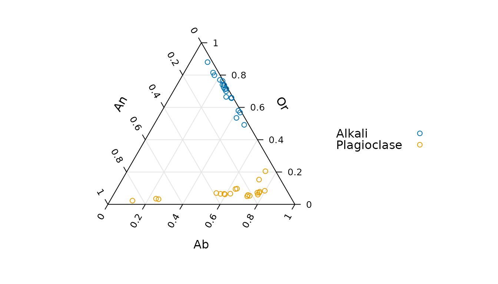
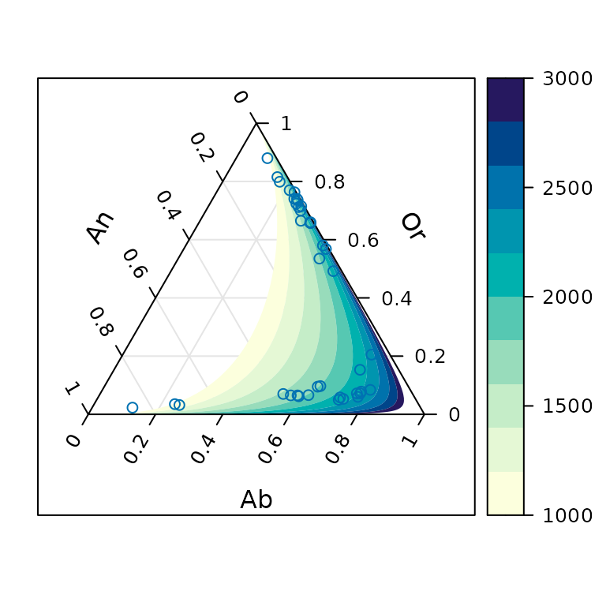
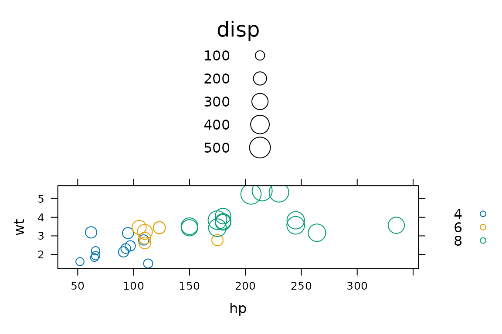

# New high-level functions

**tactile** introduces a few new high-level functions to the
latticeverse. This vignette will be updated as new functions are added.

## `ternaryplot()`: Ternary plots

Ternary plots display proportions of three variables on a
two-dimensional grid are popular in compositional analysis. tactile can
be used to generate ternary plots with
[`ternaryplot()`](https://jolars.github.io/tactile/reference/ternaryplot.md)
which takes formula, matrix, or data.frame objects an input. The formula
method – the focus of this vignette – used the form `top ~ left * right`
in terms of the dimensions of the ternary diagram.

To showcase the use of
[`ternaryplot()`](https://jolars.github.io/tactile/reference/ternaryplot.md)
we’ll use data from an article by Grove and Jenkins that has been
imported into tactile and made available simply by calling `feldspar`.
We begin with the simplest form of a ternary plot.

``` r
library(tactile)
#> Loading required package: lattice
ternaryplot(Or ~ An * Ab, data = feldspar)
```


All of the bells and whistles of lattice graphics are available in
tactile too, and we may benefit here by, for instance, grouping
variables by the *coexisting feldspar* factor `Feldspar`. Here, we also
remove the useless box around the plot.

``` r
ternaryplot(Or ~ An * Ab,
  groups = Feldspar, data = feldspar,
  auto.key = list(space = "right"),
  par.settings = list(axis.line = list(col = "transparent"))
)
```



Another feature to visualize the compositions, which would make more
sense with a larger dataset, is to add two-dimensional density
estimates. We do this by setting the `density` argument to `TRUE`.
Instead of superposing the two types of composite feldspars, we now
condition instead.

``` r
ternaryplot(Or ~ An * Ab | Feldspar, data = feldspar, density = TRUE)
```


These density estimations are produced by first applying a isometric log
transformation and then computing density estimates with
[`MASS::kde2d()`](https://rdrr.io/pkg/MASS/man/kde2d.html) before
returning the coordinates to the ternary coordinate space.

One more feature that is available is to model a response on our
compositional data. We (obviously) need a separate outcome variable for
this and will here use the temperature of the reaction from the feldspar
experiments, offering examples of a version with region fills and one
with contours.

``` r
ternaryplot(Or ~ An * Ab,
  response = Pressure, data = feldspar,
  contour = FALSE
)
ternaryplot(Or ~ An * Ab, response = Pressure, data = feldspar, region = FALSE)
```



## `bubbleplot()`: Bubbleplots

Bubble plots are simple scatter plots that have been extended to a third
dimensions by mapping a third variable to the size (area) of the plot
symbols, which theoretically could be anything but usually is points.
Bubble plots were made famous by the late Hans Rosling.

Bubble plots in tactile are available with
[`bubbleplot()`](https://jolars.github.io/tactile/reference/bubbleplot.md)
and take a formula of the type `bubblesize ~ x * y` as its first
argument. We illustrate with with the `mtcars` data set from **R** that
sports the features of 32 cars from the *1974 Motor Trend US* magazine.
We start by mapping the displacement to the bubble size against
horsepower (hp) and weight (wt).

``` r
bubbleplot(disp ~ hp * wt, groups = cyl, data = mtcars, auto.key = TRUE)
```



More elaborate designs can be fashioned if we were to combine the plot
with some of the specialized panel functions from lattice. Here, we also
change to a filled circle design with semitransparent bubbles.

``` r
bubbleplot(disp ~ hp * wt | factor(cyl),
  data = mtcars, auto.key = TRUE,
  pch = 16, alpha = 0.5, layout = c(3, 1),
  panel = function(x, y, z, ...) {
    panel.lmline(x, y, ...)
    panel.bubbleplot(x, y, z, ...)
  }
)
```


