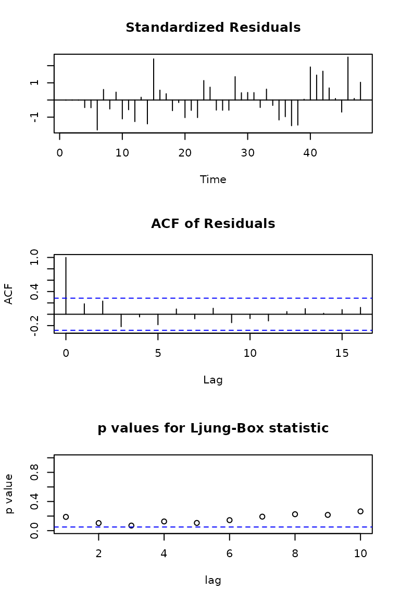
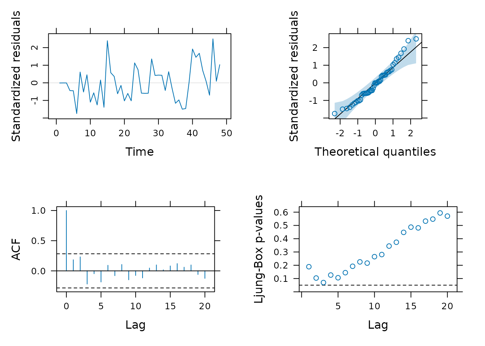
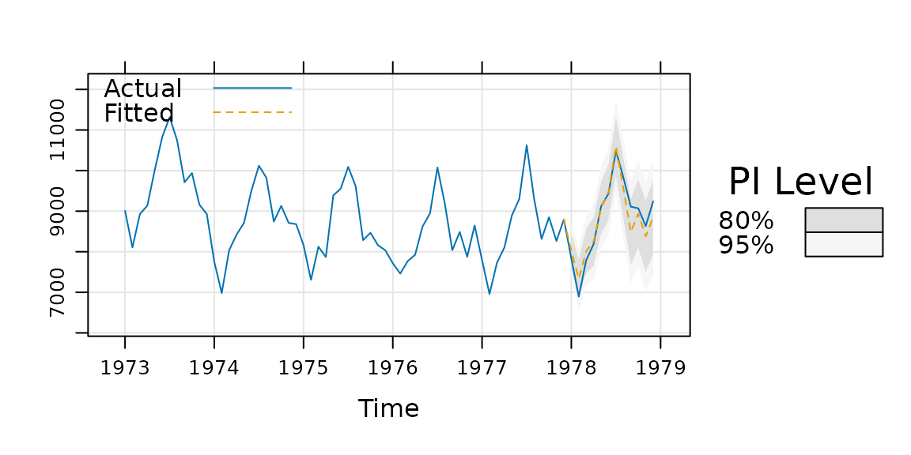
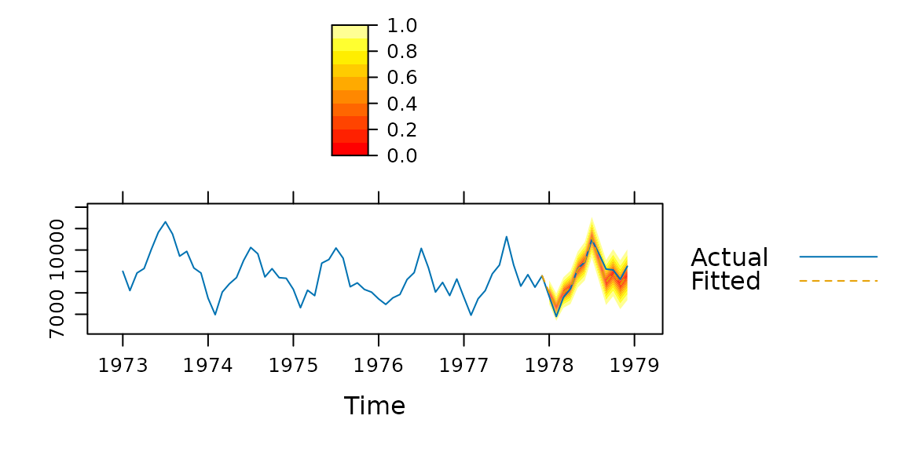

# New methods

## `xyplot.lm()`: Linear model diagnostics

tactile provides an
[`xyplot()`](https://rdrr.io/pkg/lattice/man/xyplot.html) method for
`lm` objects – usually generated with
[`stats::lm()`](https://rdrr.io/r/stats/lm.html) or
[`stats::glm()`](https://rdrr.io/r/stats/glm.html). It provides the same
type of diagnostic plots that
[`stats::plot.lm()`](https://rdrr.io/r/stats/plot.lm.html) covers, with
some small modifications This method is provided so that a user may use
lattice graphics throughout out a

document, say for a lab report, and produce consistent graphic material
that can be changed on a general level (for instance by using
[`lattice.options()`](https://rdrr.io/pkg/lattice/man/lattice.options.html)).

### Usage

We fit a simple linear model

``` r
fit <- lm(Sepal.Length ~ Sepal.Width, data = iris)
```

Here, we fist use the default option and plot the diagnostics using
`stats::plot()`

``` r
par(mfrow = c(3, 2), cex = 1)
plot(fit, which = 1:6)
```


Plot diagnostics with
[`stats::plot.lm()`](https://rdrr.io/r/stats/plot.lm.html).

``` r
par(mfrow = c(1, 1))
```

Or instead use the method provided by tactile.

``` r
library(tactile)
#> Loading required package: lattice
xyplot(fit, which = 1:6)
```


Plot diagnostics with
[`xyplot.lm()`](https://jolars.github.io/tactile/reference/xyplot.lm.md).

You will see that the results are similar. The benefits, however, of
using
[`xyplot.lm()`](https://jolars.github.io/tactile/reference/xyplot.lm.md)
from tactile are that

- handling of plot margins is much improved,
- the plots are returned as a list of trellis objects (that can be
  updated),
- general plot settings from `lattice` are respected (mostly), and
- you no longer have to specify `par(mfrow = c(2, 2))`. The plots are
  arranged via
  [`gridExtra::grid.arrange()`](https://rdrr.io/pkg/gridExtra/man/arrangeGrob.html)
  automatically and arguments `nrow` and `ncol` have been made
  accessible in the
  [`xyplot.lm()`](https://jolars.github.io/tactile/reference/xyplot.lm.md)
  call to enable manual specifications.

## `xyplot.Arima`: ARIMA Model Diagnostics

This function is similar to
[`xyplot.lm()`](https://jolars.github.io/tactile/reference/xyplot.lm.md)
but is modeled after
[`stats::tsdiag()`](https://rdrr.io/r/stats/tsdiag.html). First, we look
at the output from the original.

``` r
fit <- arima(lh, c(0, 0, 1))
tsdiag(fit)
```



To use the method from tactile, we just call
[`xyplot()`](https://rdrr.io/pkg/lattice/man/xyplot.html) on the model
fit. The most prominent difference here is that we’ve added a Q-Q plot
of the standardized residuals as well, but also that we’re correcting
the Ljung–Box test to account for the fact that we’ve fit a model.

``` r
xyplot(fit)
```



## `xyplot.forecast()`: Plotting forecasts with tactile

Robert Hyndman’s excellent
[forecast](https://cran.r-project.org/package=forecast) package has
built-in functions for plotting forecasts. These have been reworked to
use lattice graphics in tactile, and also try to place the forecasts on
the time scale of the original data (if such is provided).

For this example, we user `USAccDeaths`, a time series giving the
monthly totals of accidental deaths in the USA. We begin by separating
the series into a training and test set.

``` r
library(forecast)
#> Registered S3 method overwritten by 'quantmod':
#>   method            from
#>   as.zoo.data.frame zoo
train <- window(USAccDeaths, c(1973, 1), c(1977, 12))
test <- window(USAccDeaths, c(1978, 1), c(1978, 12))
```

Then we fit the model and plot the results.

``` r
fit <- arima(train, order = c(0, 1, 1), seasonal = list(order = c(0, 1, 1)))
fcast1 <- forecast(fit, 12)
xyplot(fcast1, test,
  grid = TRUE, auto.key = list(corner = c(0, 0.99)),
  ci_key = list(title = "PI Level")
)
```



A so called fan plot can be achieved by increasing the number of
prediction intervals in the call to `forecast`. We also switch to a
separate color palette by using the `ci_pal` argument.

``` r
# A fan plot
fcast2 <- forecast(fit, 12, level = seq(0, 95, 10))
xyplot(fcast2, test, ci_pal = heat.colors(100))
```


