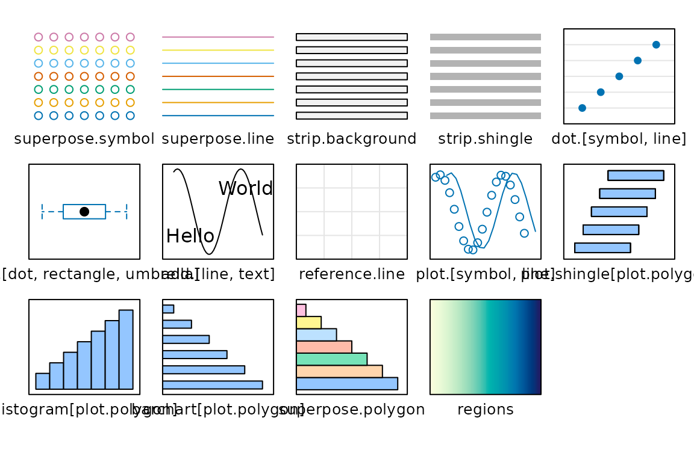
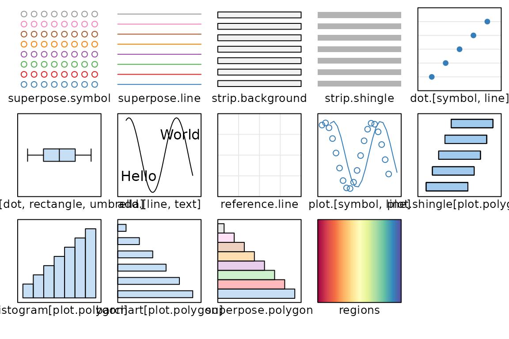
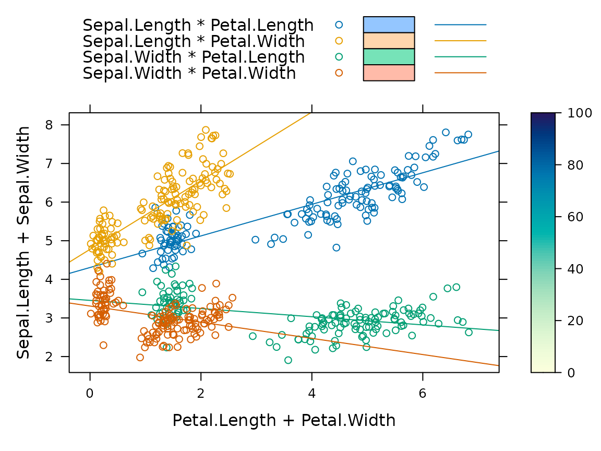
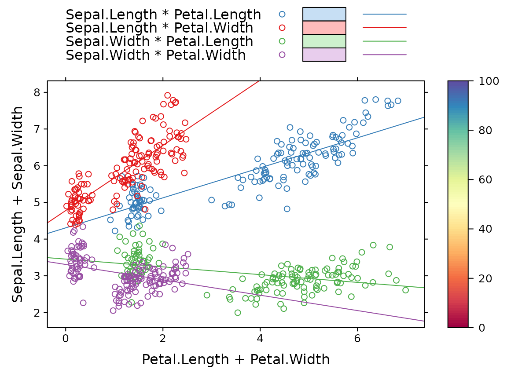

# The tactile theme

**tactile** introduces a new theme for **latice** that does a few
things, namely

- minimizes paddings around the plot,
- halves axis tick lengths,
- uses a color theme based on **RColorBrewer**,
- decreases title size *slightly*,
- Sets strip backgrounds to grey.

We now turn to illustrating the differences. First, we use
[`lattice::show.settings()`](https://rdrr.io/pkg/lattice/man/trellis.par.get.html)
for an overview over the default settings.

``` r
library(tactile)
#> Loading required package: lattice
show.settings()
show.settings(tactile.theme())
```



Then we plot a sample plot (from
<http://latticeextra.r-forge.r-project.org/>).

``` r
set.seed(0)

## create a plot to demonstrate graphical settings
obj <- xyplot(
  Sepal.Length + Sepal.Width ~ Petal.Length + Petal.Width,
  iris,
  type = c("p", "r"),
  jitter.x = TRUE,
  jitter.y = TRUE,
  factor = 5,
  auto.key = list(lines = TRUE, rectangles = TRUE, space = "top")
)

obj <- update(
  obj,
  legend = list(
    right = list(
      fun = "draw.colorkey",
      args = list(list(at = 0:100))
    )
  )
)

## draw with default theme
obj
```



``` r
## draw with tactile.theme()
update(obj, par.settings = tactile.theme())
```


